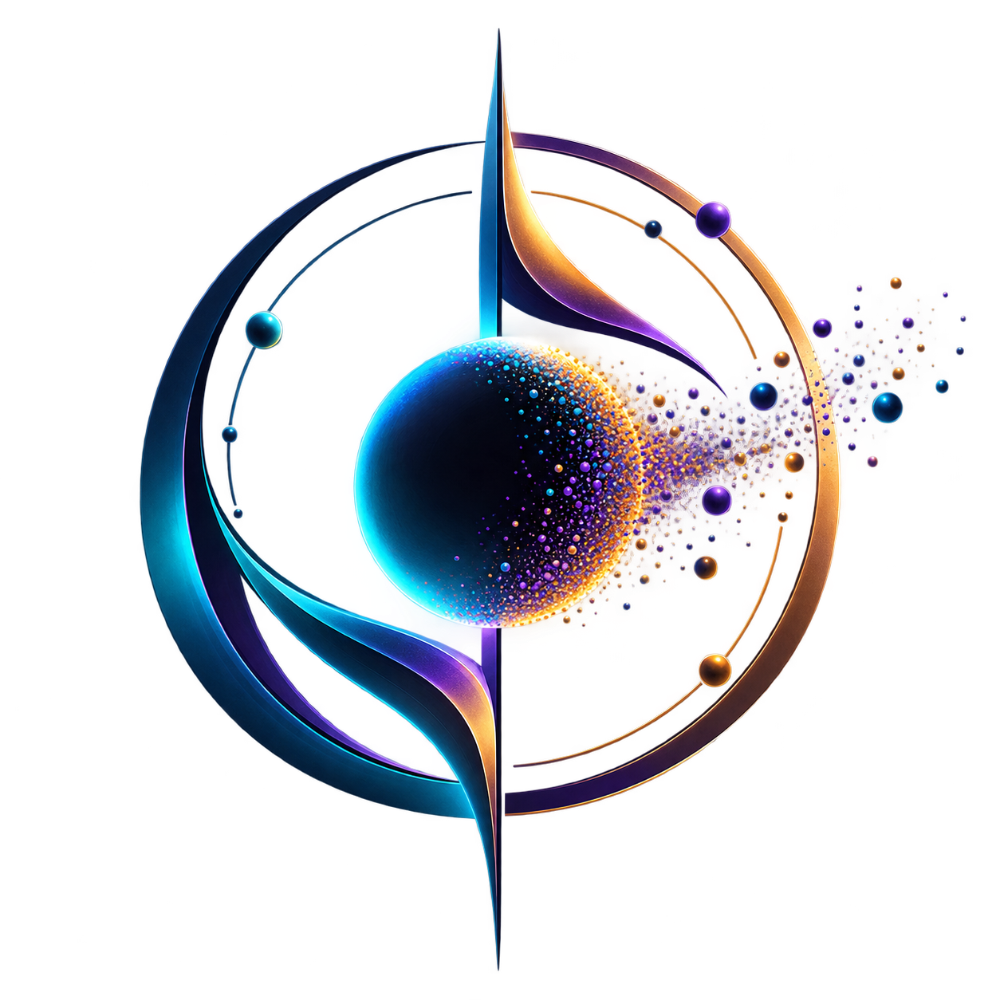

<div align="center">
  
  <h1>✨ Astral Dust ✨</h1>
  <p><b>An interactive, hand-reactive 3D particle sphere built with Three.js and MediaPipe.</b></p>
</div>

<div align="center">
  <video src="https://github.com/user-attachments/assets/03a3d798-c767-41ad-aa35-2ba6caf824fa" width="800" autoplay loop muted playsinline></video>
</div>

<br/>

## 🌌 Overview

Astral Dust is a highly optimized, browser-based 3D experience that tracks your hands in real-time. By utilizing **Google's MediaPipe** for precise skeletal tracking and **Three.js** for high-performance WebGL rendering, the "Astral Dust" sphere fluidly reacts to your physical gestures without the need for any external controllers or VR headsets.

The UI is built with modern, ultra-premium glassmorphism aesthetics, adapting its color palette dynamically by analyzing your room's ambient lighting through the webcam.

---

## ✋ Gestures & Interactions

The particle system physics engine actively monitors the depth and position of your hands to trigger cinematic transitions:

| Gesture | Action | Description |
| :--- | :--- | :--- |
| **Move** | Track Position | The sphere locks onto the center of your palm and smoothly glides to follow your hand movements. |
| **Pinch** | Compress & Scatter | Pinching your thumb and index finger compresses the sphere tightly. Releasing the pinch unleashes a localized burst of outward kinetic force, scattering the dust! |
| **Two Hands** | Split & Expand | Bringing a second hand into the frame dynamically splits the particles into two distinct clouds. Spreading your hands apart expands the unified sphere, and bringing them together merges the clouds back into one. |

---

## 🎨 Key Features

- **Real-Time Hand Tracking:** Zero-latency skeletal tracking using MediaPipe Vision Tasks.
- **Custom Physics Engine:** Features spring-based easing, repulsion forces, and localized bursting math.
- **Adaptive Ambient Lighting:** The sphere continuously samples your webcam feed and shifts its hue to complement your environment (e.g., Electric Cyan for bright rooms, Warm Amber for dark environments).
- **Glassmorphism HUD:** A fully responsive, frosted-glass overlay that provides real-time telemetry of your hand coordinates and current gesture state.

---

## 🚀 Local Setup

To run Astral Dust locally on your machine:

1. **Clone the repository:**
   ```bash
   git clone https://github.com/priyanshusharan-cmd/astral-dust.git
   cd astral-dust
   ```

2. **Install dependencies:**
   ```bash
   npm install
   ```

3. **Start the development server:**
   ```bash
   npm start
   ```

4. **Experience it:**
   Open [http://localhost:3000](http://localhost:3000) in your browser. Ensure you grant camera permissions when prompted!

---

<div align="center">
  <p>Crafted with ❤️ by <b>Priyanshu Sharan</b></p>
</div>
